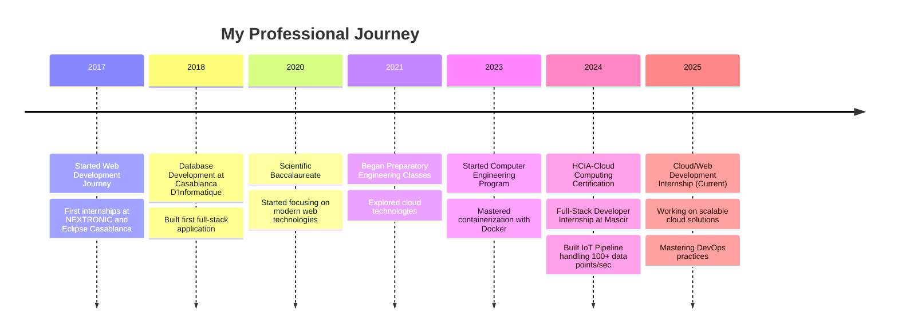

# Mohamed Lakssir | Full-Stack Developer

> Building intuitive digital experiences with React, TypeScript, and data visualization | Making complex data understandable

## 👨‍💻 About **Me**

- 🎓 I'm a second-year Computer Engineering student at Mundiapolis University, currently interning while pursuing my studies.
- 🌱 I'm building a camera configuration app with React and Tailwind CSS (reducing setup time by 20%) and have completed a task management app for the "Education Digital Twin" system using TypeScript and D3.js.
- 🔍 Passionate about crafting intuitive web solutions and visualizing data with ML and modern tech stacks, focusing on real-time data analysis and visualization.
- 🎶 Outside of tech, I enjoy long drives, relaxing on the beach, and listening to piano music.
- 🚀 Currently exploring LLM integrations in web applications and improving my DevOps skills with CI/CD pipelines.

### 📊 GitHub Stats

### 🐱 My Virtual Pet

Check out my progress on the #30NitesOfCode challenge! [View my journey](https://www.codedex.io/@Thejokers69ML/30-nites-of-code)

### 🚀 Learning Journey

### 🌟 Projects

*(Private) Repo: Camera Configurator and Task Manager for Education Digital Twin.*

Here are some of my standout projects:

- **[Real-Time IoT Monitoring System](https://github.com/thejokers69/Dockerized-IoT-Dataflow)**  
  Dockerized pipeline for sensor data visualization, handling 100+ data points/sec.  
  *Tech Stack*: Docker, MQTT, InfluxDB, Grafana  
  *Metrics*: Reduced setup time by 40%, improved data processing efficiency by 25%  
  *Takeaway*: *Mastered real-time data pipelines for IoT scalability.*  
  
- **[AI-Powered Banking Chatbot](https://github.com/thejokers69/E-bank-Chatbot)**  
  Spring MVC chatbot with RAG integration, cutting query resolution time by 15%.  
  *Tech Stack*: Java, Spring MVC, TensorFlow, RAG  
  *Metrics*: 15% faster customer query resolution, 90% accuracy in document analysis  
  *Takeaway*: *Blended AI with user-facing apps.*

- **[Travel Reservation API](https://github.com/thejokers69/travel-reservation-api)**  
  REST API for travel bookings with automated pricing logic.  
  *Tech Stack*: Node.js, Express, MongoDB  
  *Metrics*: Handles 200+ concurrent requests, 99.5% uptime  
  *Takeaway*: *Improved API efficiency with middleware.*

- **[Data Analyzer](https://github.com/thejokers69/analyseur_donnees)**  
  Django app for crunching data files with visualizations like heatmaps.  
  *Tech Stack*: Python, Django, Pandas, Seaborn  
  *Metrics*: Processes datasets up to 500MB with optimized memory usage  
  *Takeaway*: *Streamlined data insights with clean code.*

### 🛠️ Code Quality Practices

I'm committed to maintaining high-quality code in all my projects:

- **Testing**: Implementing unit tests with Jest, PyTest, and JUnit
- **CI/CD**: Using GitHub Actions for automated testing and deployment
- **Documentation**: Detailed READMEs, inline comments, and API documentation
- **Code Reviews**: Actively seeking feedback through pull requests
- **Performance**: Optimizing for speed and resource efficiency

### 🤝 Contributions

I'm sharpening my skills on real-world projects and I'm eager to dive into open-source collabs. Got a cool idea? Let's code it up!  
**[Join me on GitHub](https://github.com/thejokers69)**

I'm particularly interested in contributing to:

- Data visualization libraries
- React/TypeScript tooling
- Developer productivity tools

### 📫 Contact Information

Love to talk tech, data viz, or beach vibes? Hit me up!  

- 🌐 [Linktree](https://linktr.ee/MohamedLakssir) 
- 💻 [GitHub](https://github.com/thejokers69) 
- 🔗 [Portfolio](https://www.thejokers69.tech) 
- 📧 [Email](mailto:contact@thejokers69.tech) 

### 🔧 Skills & Technologies

#### Languages

 (currently learning)

#### Frontend

#### Backend & Databases

#### Tools & Deployment

#### Development Environment

#### Operating Systems

### 🏆 Certifications & Learning

 Responsive Web Design
 Machine Learning Foundations
